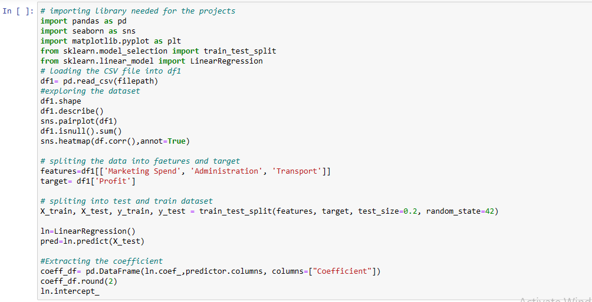
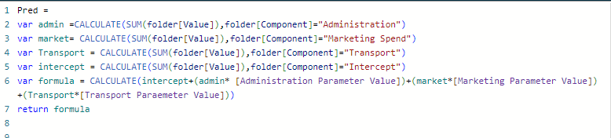
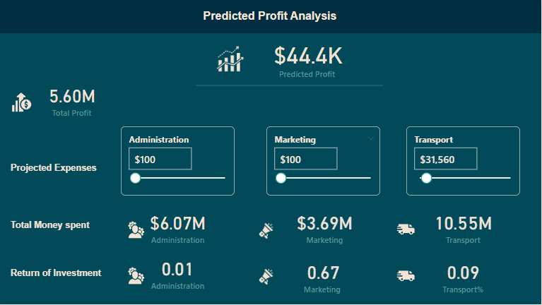

# Predictive Analysis for organization 
Predictive Analysis for organization profit using Python and Power BI

    

## Overview
The project aims to predict an organization’s profit based on its Administration, Marketing, and transportation expenses using a linear regression model. The analysis was conducted in Python using Scikit-Learn and later integrated into Power BI for interactive predictions. 

##Project Flow:

1. **Data collection and preparation**: The dataset used for this project was obtained from Kaggle, and I further cleaned and formatted the dataset to ensure data quality and consistency. 

2. **Analysis**: I used pandas, matplotlib, and Scikit–Learn in the Python library to perform linear regression analysis on the dataset. This involved the training of a regression model using Administration, Marketing, and Transportation expenses as features and profit as the target variable.

   

4. **Model Evaluation**: I evaluated the model’s performance by checking the R- mean squared and mean squared error to assess its fit to the data. 
Coefficient Extraction: I extracted the coefficient from the trained regression model. These coefficients represent the relationship between each variable and the predicted profit.

5. **Power BI Integration**: I imported the Python code into the Power BI Python environment in other to get the table for the coefficient. After creating this table, I also created a slide parameter that allows users to choose different scenarios. 

6. **Predicted Profit Analysis**: I used the model parameters and allowed users to input values for administration, marketing, and transportation expenses in Power BI.

    

# Conclusion 
This project showcases the process of performing predictive analysis for organizational profit using a linear regression model. This same analysis can be done on the machine maintenance routine by predicting failure time. 

## Skill Set
This project sparked my curiosity on how to get input from users in power BI. 
I am available for the Data Analysis role. 

**Contact Mail**: [Mail](aderounmuabrax@gmail.com)

 
 

